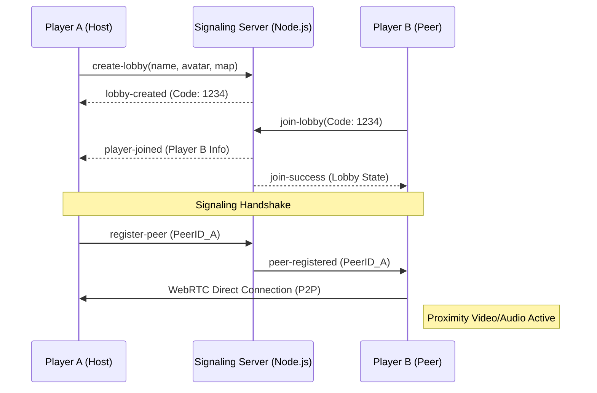

# 

# SnappyWorld: A Parallel & Distributed Virtual Space

Welcome to **SnappyWorld**, a high-performance virtual gathering platform designed for seamless interaction, real-time collaboration, and immersive proximity-based communication. 

Built as a modern "tambayan" (social hangout), SnappyWorld leverages cutting-edge distributed networking to mimic real-world physics: your video and audio presence dynamically adjust based on your spatial proximity to others, fostering organic and spontaneous digital connections.

---

## 🚀 How It Works: Under the Hood

SnappyWorld is a sophisticated **Distributed System** designed to handle high-concurrency interactions with minimal latency.

### 1. Hybrid Networking Architecture
We utilize a multi-layered networking model to optimize for both reliability and performance:
- **Signaling Layer (Socket.io)**: A Node.js coordinator handles lobby management, player state, and "signaling"—the process where peers discover each other and negotiate connections.
- **Media Streaming Layer (PeerJS/WebRTC)**: High-bandwidth video and audio data are streamed Peer-to-Peer (P2P). This distributed approach offloads heavy media processing from the server to the client's edge, ensuring scalability.

### 2. High-Frequency State Synchronization
The world state (player positions, animations, and directions) is managed via an **Event-Driven Architecture**:
- **20Hz Broadcast Loop**: The server maintains a 50ms heartbeat loop. It tracks "dirty" lobbies (those with active movement) and broadcasts position deltas to all connected clients in parallel.
- **Serialization**: Data is serialized into compact arrays (e.g., `[id, x, y, dir, frame]`) to minimize packet size and prevent network congestion.

### 3. Spatial Partitioning & Proximity Logic
The "Proximity Chat" feature is a **Distributed Computation**:
- Each client calculates its distance to other avatars locally.
- Volume levels and video opacity are mapped to a 3D distance vector, meaning the server never has to process expensive spatial audio math for hundreds of users.

---

## 🏗️ Codebase Structure

The project is organized into a clean, modular structure:

```text
├── client/                 # Frontend Assets & Logic
│   ├── assets/             # Sprites, Maps (JSON), and Audio
│   ├── js/                 # Phaser 3 Game Engine & UI Logic
│   └── styles/             # Modern Vanilla CSS (Glassmorphism)
├── server/                 # Backend Node.js Environment
│   ├── minigames/          # Modular Minigame Logic (Server-side)
│   ├── index.js            # Main Entry Point & Socket Handling
│   └── lobbyManager.js     # Lobby Lifecycle & Sync Logic
├── stress-test.yml         # Artillery Configuration for Load Testing
├── package.json            # Dependencies & Scripts
└── railway.json            # Deployment Configuration
```

---

## 🎮 The Minigame Ecosystem

SnappyWorld features a robust, modular minigame engine that allows for synchronized multiplayer sessions within any lobby.

| Game | Type | Players | Key Features |
| :--- | :--- | :--- | :--- |
| **Poker** | Cards | 2–5 | Texas Hold'em, auto-blinds, split-pots, showdown logic. |
| **Tongits** | Cards | 2–4 | Localized card game with complex melding and draw/discard logic. |
| **UNO** | Cards | 2–5 | Action cards (Skip, Reverse, +4), wild color selection, UNO calls. |
| **Battleship** | Strategy| 2 | Secret placement phase, grid-based firing, ship sinking logic. |
| **Checkers** | Board | 2 | Mandatory jumps, king promotion, multi-jump chains. |
| **Connect 4** | Casual | 2 | Gravity-based physics, 4-in-a-row detection. |
| **Tic-Tac-Toe**| Casual | 2 | Classic quick-play board game. |

> [!TIP]
> **State Sanitization**: For card games like Poker and UNO, the server implements state sanitization. Opponent "hole cards" are removed from the data packet before being sent to the client, preventing cheating via browser console inspection.

---

## ⚡ Stress Testing & Performance

We use **Artillery** to validate the system's ability to handle massive concurrent loads.

### Load Test Scenario
Our `stress-test.yml` simulates real user behavior:
1.  **Lobby Creation**: Users generate a unique 4-digit code.
2.  **Continuous Movement**: Users simulate walking around for 10 seconds, hitting the 20Hz sync loop.
3.  **Concurrency Phases**: 
    - **Warm up**: 5 users/sec.
    - **Ramp up**: Gradually scales to 50 users/sec.
    - **Sustained**: Maintains 50 concurrent arrivals.

### Running the Test
To execute a local stress test, ensure the server is running and execute:
```bash
npx artillery run stress-test.yml
```

---

## 🛰️ Connection Lifecycle & Signaling

The following diagram illustrates how a distributed P2P connection is established through our signaling server:



---

## 📡 Distributed Event Reference (Socket.io)

### Client to Server
| Event | Payload | Description |
| :--- | :--- | :--- |
| `create-lobby` | `{playerName, avatarId, mapId}` | Initializes a new lobby instance. |
| `join-lobby` | `{code, playerName, avatarId}` | Attempts to join an existing 4-digit lobby. |
| `player:move` | `{x, y, direction, frame}` | Sends position updates (processed at 20Hz). |
| `register-peer`| `{peerId}` | Registers the WebRTC ID for P2P signaling. |
| `chat:message` | `{text}` | Broadcasts a message to the lobby room. |
| `music:control`| `{command, songId}` | Controls the shared lobby music player. |

### Server to Client
| Event | Payload | Description |
| :--- | :--- | :--- |
| `lobby:sync` | `[[id, x, y, dir, frame], ...]`| Batch update of all player positions. |
| `player-joined`| `{player, lobby}` | Notifies clients of a new participant. |
| `peer-registered`| `{socketId, peerId}` | Triggers a P2P connection attempt. |
| `music:sync` | `{currentSong, isPlaying, ...}`| Synchronizes audio playback state. |
| `host-left` | `{message}` | Notifies that the lobby is closing. |

---

## 🛠️ Modular Minigame Development

Adding a new minigame is as simple as creating a new logic file in `server/minigames/`.

### Minigame Interface
Each game must export an object with the following structure:
```javascript
module.exports = {
  id: 'mygame',
  name: 'My New Game',
  minPlayers: 2,
  maxPlayers: 4,
  flexibleStart: true, // Uses the 'Ready' lobby system
  
  createState: (playerCount) => ({ /* Initial state */ }),
  handleMove: (state, role, data) => ({ state, events: [] }),
  checkEnd: (state) => ({ ended: boolean, winner: string }),
  getSanitizedState: (state, role) => ({ /* Filtered state */ })
};
```

---

## 🌐 Deployment & Environment

### Railway Configuration
The project is optimized for **Railway** deployment using the following parameters:
- **Build Command**: `vite build client`
- **Start Command**: `node server/index.js`
- **Environment**: Nixpacks with Node.js 18.

### Environment Variables
| Variable | Description | Default |
| :--- | :--- | :--- |
| `PORT` | The port the server listens on | `3000` |
| `NODE_ENV`| Set to `production` for optimized networking | `development` |

---

## 🤝 Contribution & Credits
- **Lead Developer**: Ronald Franco Galendez
- **Tech Stack**: Phaser 3, Socket.io, PeerJS, Express.
- **Project Purpose**: Parallel and Distributed Computing (PDC) Laboratory.

---
*Created as part of the Parallel and Distributed Computing (PDC) project. Focus on performance, scalability, and user engagement.*
